# i18n Swapper

<div align="center">


**一站式 VSCode 国际化解决方案，让多语言项目开发效率提升 n 倍**

</div>

> ⚠️ **注意：当前 README 对应 v1.0.0 之前的旧版本，v1.0.0 完整文档正在撰写中，敬请期待。**
> 新版本（v1.0.0）在原有功能基础上重构了全部代码，新增了 Android / iOS 双端支持，界面与交互全面升级。

<p align="center">
  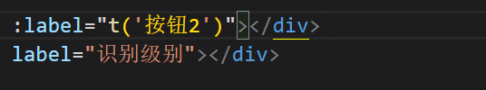
</p>

## 安装

选择以下任一方式安装：

1. VSCode/Cursor 应用商店中搜索 **i18n swapper**
<p align="left">
  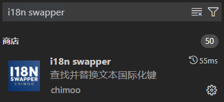
</p>

2. VSCode 命令面板 (`Ctrl+P`) 输入：
   ```
   ext install chimoo.i18n-swapper
   ```

3. 直接从 [VSCode Marketplace](https://marketplace.visualstudio.com/items?itemName=chimoo.i18n-swapper) 下载

## ❗核心配置❗

### 首次安装将提示选择源语言文件：

<p align="left">
  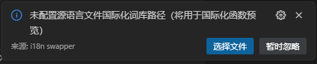
</p>

- 如已有中文国际化键值库，请选择【选择文件】
- 系统将根据源语言库，自动转义 t 方法到预览模式

<p align="center">

# **ok，已配置完成，享受高效国际化体验吧！🎉🎉🎉**

</p>

## 功能介绍

i18n-swapper 是一款专为国际化工程化设计的 VSCode 扩展，支持 **Web / Android / iOS** 三端，将繁琐的国际化流程简化至极。

### 功能亮点

- 👁️ **实时预览**：代码中直接查看翻译结果，所见即所得
- 🔍 **智能检测**：自动识别需国际化的文本，精准定位
- 🔄 **一键替换**：单击完成文本到国际化函数的转换
- 📦 **批量处理**：扫描整个项目，一次性处理所有国际化内容
- 🌐 **多语言支持**：集成翻译 API，支持 28+ 种语言自动翻译
- ⚙️ **高度可定制**：自定义函数名、样式、键名生成规则等
- 🔑 **智能键名**：基于内容自动生成有意义的键名，无需手动命名
- 📱 **三端覆盖**：Web（Vue/React）/ Android（XML strings）/ iOS（Localizable.strings）

### 翻译方式

#### 1. 单体翻译功能

选中文本，右键菜单"替换为国际化调用"或快捷键 `Ctrl+Alt+Y`/`Cmd+Alt+Y`：

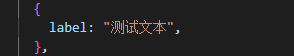

#### 2. 批量替换功能

- **快速批量替换**（`Ctrl+Alt+B`/`Cmd+Alt+B`）：扫描当前文件，自动替换已存在的文本
- **可视化批量替换**：通过面板界面管理替换过程

<p align="left">
  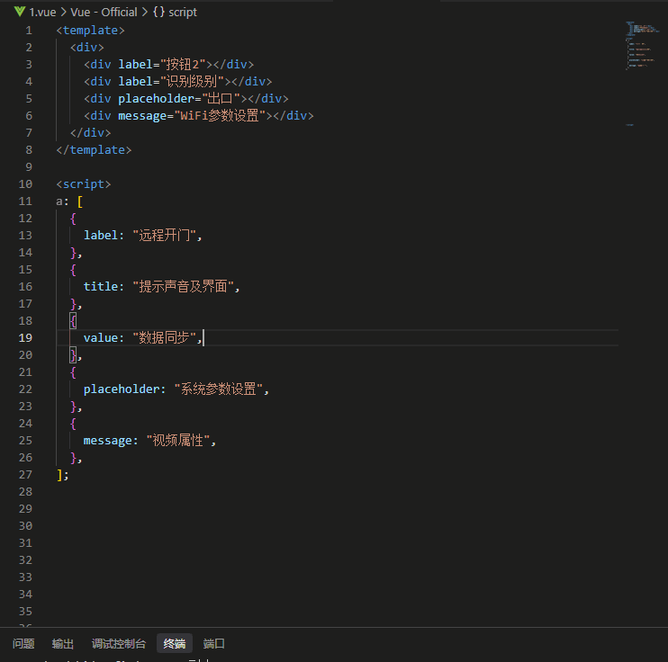
</p>

### 进阶🚀 面板功能【全局可视化管理】

右键菜单"i18n Swapper: 打开管理面板"打开国际化管理面板。

<p align="left">
  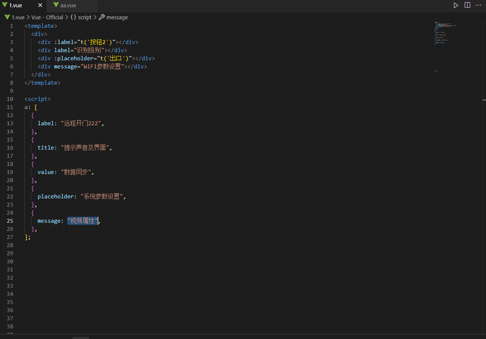
</p>

#### 核心功能：

##### 1. 文本高亮识别

<p align="left">
  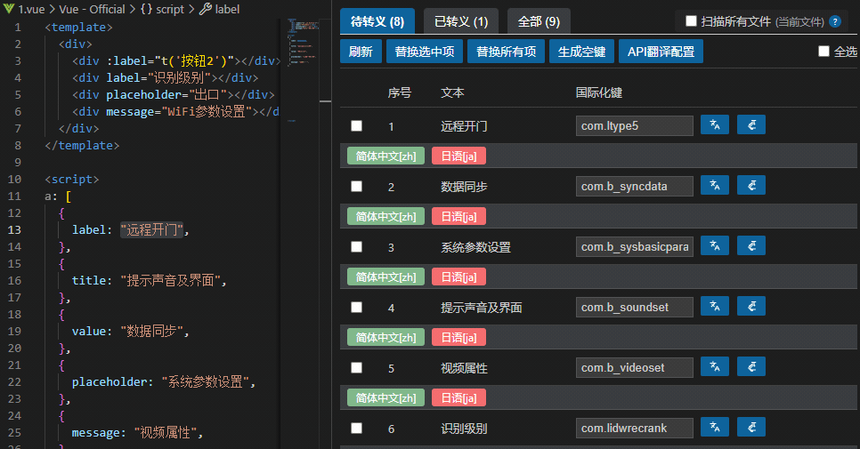
</p>

##### 2. 国际化函数智能转义

<p align="left">
  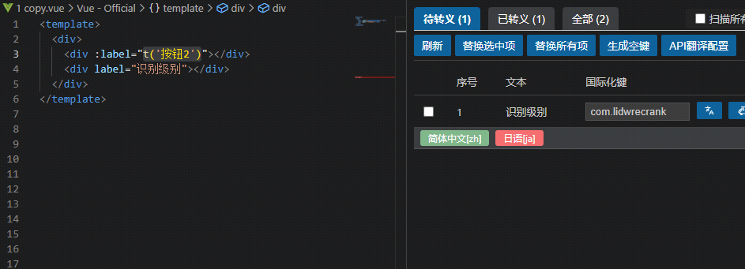
</p>

##### 3. 智能键路径填充

自动检索源语言库，反推键路径，一键完成替换

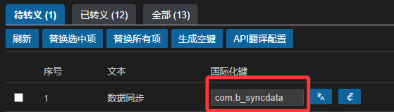

##### 4. 多语言缺失检测

通过颜色直观展示各语言文件翻译状态（绿色存在，红色缺失）

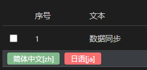

##### 5. 一键多语言翻译

<p align="left">
  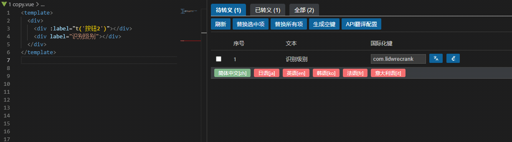
</p>

##### 6. 灵活替换模式

<p align="left">
  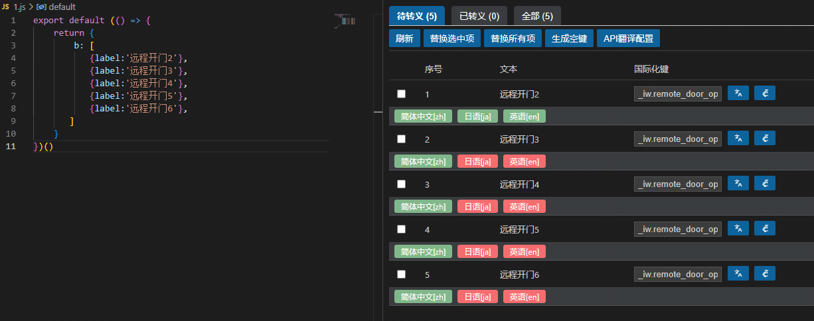
</p>

##### 7. 语言文件快速操作

<p align="left">
  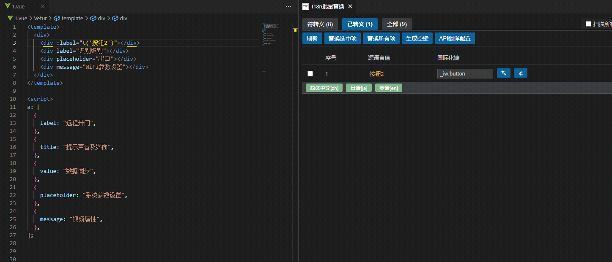
</p>

##### 8. 自动键名生成

<p align="left">
  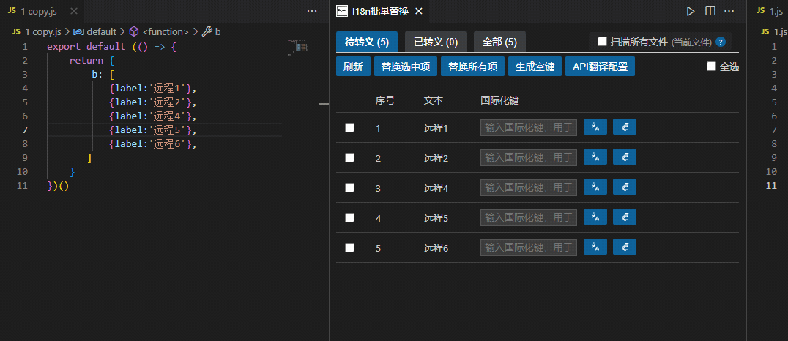
</p>

##### 9. 便捷悬浮操作面板

<p align="left">
  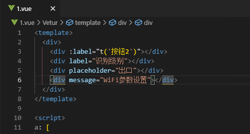
</p>

##### 10. 全项目扫描【重磅】

<p align="left">
  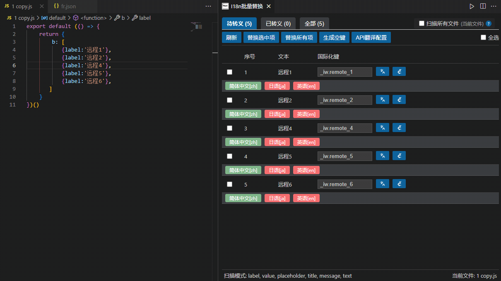
</p>

### 配置教程

#### 1. API翻译配置

<p align="left">
  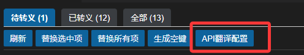
</p>

<p align="left">
  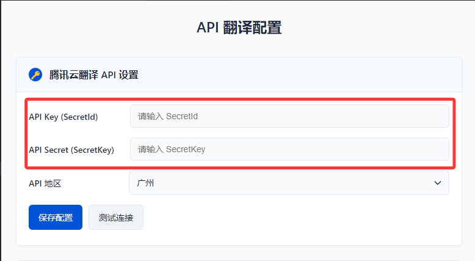
</p>

#### 2. 多语言映射配置【强烈推荐】

<p align="left">
  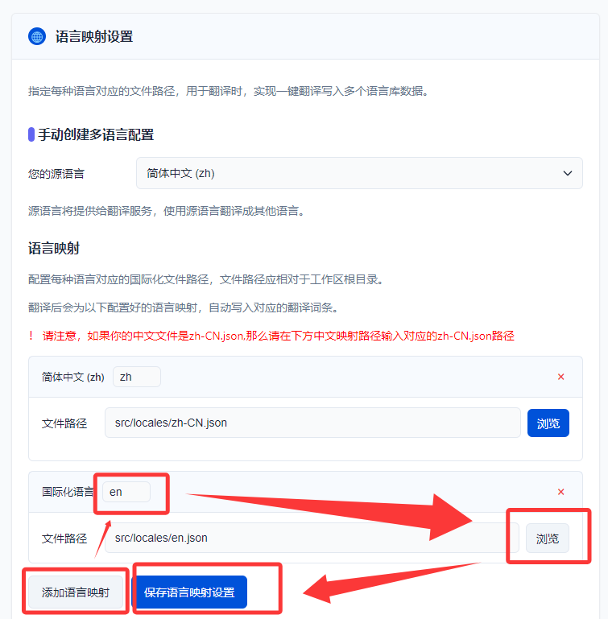
</p>

#### 3. 自定义面板设置（可选）

<p align="left">
  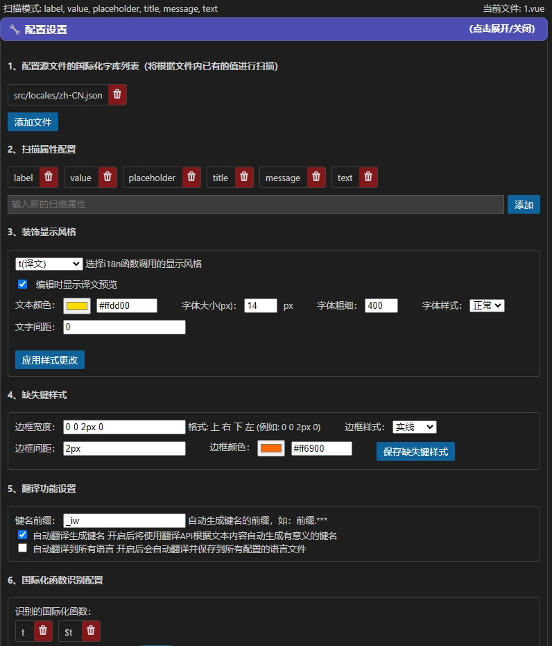
</p>
<p align="left">
  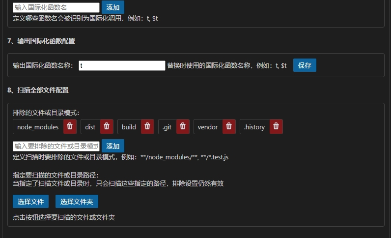
</p>

## 快速上手

### 1. 设置国际化文件

首次使用：
1. 打开命令面板 `Ctrl+Shift+P`/`Cmd+Shift+P`
2. 选择 `i18n Swapper: 设置国际化文件路径`
3. 选择国际化文件

### 2. 单文本替换

选中文本 → 快捷键 `Ctrl+Alt+Y`/`Cmd+Alt+Y`

### 3. 快速批量替换

快捷键 `Ctrl+Alt+B`/`Cmd+Alt+B`

## 技术栈

| 层级 | 技术 |
|------|------|
| 扩展后端 | TypeScript + esbuild |
| WebView 前端 | Vue 3 + Vite + Tailwind CSS v4 + Pinia |
| 包管理器 | pnpm (workspace) |

## 常见问题

**Q: 插件找不到我的国际化键？**
A: 检查国际化文件路径是否正确，确认文本完全匹配。

**Q: 支持哪些文件格式？**
A: JSON 和 JS 文件（JS 需导出对象）；Android XML strings；iOS `.strings` 文件。

**Q: 如何修改快捷键？**
A: 通过 VSCode 快捷键设置修改。

**Q: 如何获取腾讯云API密钥？**
A: 访问[腾讯云控制台](https://console.cloud.tencent.com/)，在访问管理 → API密钥管理创建。

## 许可证

i18n-swapper 遵循 [MIT License](LICENSE)。

