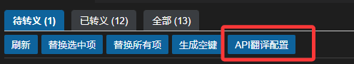

# i18n-swapper 国际化文本替换工具

<p align="center">
  
</p>

> 一个高效的 VSCode 国际化文本替换工具

## 功能介绍

i18n-swapper 是一个 VSCode 扩展，用于帮助开发者快速查找和替换国际化文本。它可以自动在国际化资源文件中查找选中文本对应的键，并替换为国际化函数调用。

### 功能特点

- 🔍 **智能检测**：自动识别代码中需要国际化的文本
- 🔄 **一键替换**：将选中文本快速替换为国际化函数调用
- 📦 **批量处理**：批量检测和替换需要国际化的文本
- 🌐 **多语言支持**：支持多种语言的自动翻译
- 👁️ **实时预览**：在代码中直接查看翻译结果
- ⚙️ **灵活配置**：支持自定义国际化函数名、样式等
- 🔑 **自动生成键名**：为空的国际化键自动生成有意义的键名，并根据配置进行翻译

### 核心功能亮点 ✨

专为中文项目设计的国际化解决方案，提供全流程开发支持：

1. **智能键值生成 & 多语言同步**
   ⌨️ 中文内容智能生成标准化键值，实时对接腾讯云翻译引擎，支持一键生成 28+ 语种翻译文件。告别重复劳动，实现多语言资源自动化同步。

2. **智能路径反推**
   🔍 基于输入内容自动定位现有国际化文件中的键路径，开发人员无需手动检索翻译文件，大幅提升维护效率。

3. **多维度翻译洞察**
   🌐 可视化呈现键值的全语种翻译状态，支持：
   - 跨语言翻译对比检查
   - 缺失翻译智能提醒
   - 一键定位目标文件路径
   - 快速跳转代码引用位置

4. **云翻译服务深度集成**
   ☁️ 无缝对接腾讯云机器翻译 API，通过配置文件快速接入：
   开发者仅需专注业务键值设计，翻译工作流完全自动化。

5. **空键批量生成与翻译**
   🔑 一键为所有空的国际化键生成有意义的键名，智能处理键名结构，并根据配置自动翻译到源语言或所有语言文件中。

### 主要特性

- 🔍 **智能文本查找**：自动在国际化文件中查找选中文本对应的键
- 📂 **多文件支持**：可配置多个国际化文件路径，同时支持 JSON 和 JS 格式
- 🔤 **智能引号处理**：自动识别和处理选中文本中的引号，无需担心选择精度问题
- ⚙️ **灵活配置**：支持自定义国际化函数名称和引号样式
- 🚀 **批量替换能力**：支持一键扫描当前文件中所有需要国际化的文本并批量替换
- 🌍 **自动翻译**：集成腾讯云翻译 API，支持一键翻译和多语言文件生成
- 👁️ **预览功能**：实时预览国际化键对应的翻译内容，提升开发体验
- 📊 **翻译状态管理**：可视化展示不同语言文件中的翻译状态，快速识别缺失翻译
- 🌟 **配置保持状态**：配置面板操作不再刷新整个面板，保留展开状态和筛选条件
- 📄 **文件名筛选功能**：支持按文件名/路径筛选国际化文本条目
- 🔍 **指定范围搜索**：支持在特定文件或目录中进行国际化文本扫描
- 🔑 **空键智能生成**：一键为所有空的国际化键生成有意义的键名并自动保存翻译

### 翻译方式

#### 1. 单体翻译功能

选中需要翻译的文本，右键菜单选择"替换为国际化调用"或使用快捷键 `Ctrl+Alt+Y`（Windows/Linux）/ `Cmd+Alt+Y`（Mac），插件会:

- 自动在国际化文件中查找选中文本对应的键
- 如果找不到，会提示输入新的键名
- 智能处理文本周围的引号和括号
- 替换为国际化函数调用，如 `t('key')`
- 兼容VUE等v-bind写法，如 `label="value"` 将被替换为 `:label="t('key')"` 为您自动添加v-bind前缀

<!-- center -->

<!-- /center -->

##### 替换流程图

单体替换功能的工作流程如下:


#### 2. 一键批量替换流程图

提供两种批量翻译方式:

- **快速批量替换**: 一键扫描当前文件中所有需要国际化的文本，对已在国际化文件中存在的文本自动替换
- **批量替换悬浮窗口**: 打开可视化悬浮窗口界面，展示当前国际化键的其他语言翻译内容

<p align="center">
  
</p>

##### 一键批量替换流程图

快速批量替换功能的工作流程如下:


> 此功能适合已有源语言库的旧项目重构场景。

如果您还没有已有的源语言库，建议使用面板功能，它将自动创建国际化键并翻译到所有语言库。

### 面板功能（重磅功能！【可视化+全局上帝视角】管理项目国际化）

右键VScode菜单选择"I18n Swapper: 打开面板"或使用快捷键`Ctrl+Alt+I`（Windows/Linux）/ `Cmd+Alt+I`（Mac），可以打开国际化管理面板。这是一个功能强大的可视化工具，让您能够以"上帝视角"管理整个项目的国际化内容。

<p align="center">
  
</p>

打开面板后：

> #### 介绍1：点击文本高亮识别

<p align="left">
  
</p>

> #### 介绍2：查看已转义/未转义的国际化函数

<p align="left">
  
</p>

> #### 介绍3：智能填充国际化键至输入框，从源语言库中检索


> #### 介绍4：智能检索其他语言缺失状态

如果您已设置[语言映射](#教程2配置多语言映射重磅功能强烈推荐)
插件会查询输入框中的国际化键，并通过颜色视图展示出来
绿色代表存在，红色代表缺失

> #### 介绍5：一键翻译到其他语言

插件会根据您的文本，请求[腾讯翻译API](#教程1配置api翻译)，再根据[多语言映射配置](#教程2配置多语言映射重磅功能强烈推荐)，生成所有语言的翻译文本


> #### 介绍5：一键替换/选中替换 文本处理国际化


> #### 教程1：配置API翻译



点击后，将弹出一个API配置面板


不知哪里获取？滚动至最下方，查看具体教程

> #### 教程2：配置多语言映射【重磅功能，强烈推荐】

在API翻译配置界面中，下方存在语言映射设置，我们需要按照界面配置它！


该模块是用于告诉插件的翻译模块，某文件是为某语言，后续将可以自动翻译并插入该文件。

打开面板后，您可以：

- 查看当前页面中未转义国际化的文本
- 查看已经转义为国际化函数的文本
- 查看所有可能需要国际化的内容
- 使用强大的筛选和管理工具进行批量操作

> 这只是面板功能的入口，在接下来的内容中，我们将展示面板中的其他强大功能。

#### 4. 自定义字段扫描

可以配置要扫描的属性字段模式（如 label、placeholder、title 等），插件会优先识别这些字段中的文本进行替换，提高批量替换的准确性。

#### 5. 多语言翻译管理

- **一键生成语言文件**: 基于源语言文件，快速创建多种语言的国际化文件
- **翻译服务集成**: 使用腾讯云翻译 API 自动翻译已有的国际化内容
- **翻译状态可视化**: 直观展示各语言翻译状态，方便管理多语言资源

#### 6. 工作区范围管理

- **全工作区扫描**: 支持扫描整个工作区的文件，而不仅限于当前文件
- **指定范围搜索**: 可以指定特定文件或目录进行扫描，提高国际化效率
- **文件名筛选**: 扫描结果支持按文件名或路径筛选，便于大型项目中的精确查找

#### 7. 空键自动生成

- **批量生成键名**: 一键为所有空的国际化键自动生成有意义的键名
- **智能生成策略**: 根据配置决定使用 API 生成有意义的键名或使用简单算法
- **自动翻译同步**: 根据配置决定是否将生成的键值翻译到所有语言文件中

### 8. 使用空键自动生成功能

1. 在批量替换面板中，点击"生成空键"按钮
2. 系统会自动为所有空的国际化键生成键名
3. 根据配置，系统会自动将生成的键名翻译到源语言或所有语言文件中
4. 操作完成后可以查看结果统计，包括成功和失败的数量

## 安装

可以通过以下几种方式安装：

1. 在 VSCode 中，按 `Ctrl+P` 打开命令面板，输入：
   ```
   ext install chimoo.i18n-swapper
   ```

2. 或直接从 [VSCode Marketplace](https://marketplace.visualstudio.com/items?itemName=chimoo.i18n-swapper) 下载

## 快速上手

### 1. 配置国际化文件路径

首次使用时，请先设置国际化文件路径：

1. 使用快捷键 `Ctrl+Shift+P`（Windows/Linux）或 `Cmd+Shift+P`（Mac）打开命令面板
2. 输入并选择 `i18n-swapper: 设置国际化文件路径`
3. 选择您的国际化文件（JSON或JS格式）

### 2. 单个文本替换

1. 在代码中选择需要国际化的文本
2. 使用快捷键 `Alt+Shift+I`（Windows/Linux）或 `Option+Shift+I`（Mac）
3. 文本将被替换为国际化函数调用，如 `t('your.i18n.key')`

### 3. 批量替换

1. 打开需要国际化的文件
2. 使用快捷键 `Ctrl+Shift+P`（Windows/Linux）或 `Cmd+Shift+P`（Mac）打开命令面板
3. 输入并选择 `i18n-swapper: 批量替换国际化`
4. 在弹出的面板中选择需要替换的文本，并执行替换

### 4. 快速批量替换

1. 打开需要国际化的文件
2. 使用快捷键 `Alt+Shift+B`（Windows/Linux）或 `Option+Shift+B`（Mac）
3. 在编辑器中直接选择并确认要替换的文本

### 5. 使用文件名筛选功能

1. 开启"扫描所有文件"选项
2. 在面板上方的筛选框中输入文件名或路径关键字
3. 系统会自动过滤并只显示匹配的文件中的条目
4. 使用方向键可以在下拉建议中快速选择文件

## 配置选项

在 `.vscode/settings.json` 中添加以下配置：

```json
{
    "i18n-swapper.localesPaths": [
        "src/locales/zh-CN.json",
        "src/i18n/messages.js"
    ],
    "i18n-swapper.quoteType": "single",
    "i18n-swapper.functionName": "t",
    "i18n-swapper.scanPatterns": [
        "value",
        "label",
        "placeholder",
        "message",
        "title",
        "text"
    ],
    "i18n-swapper.tencentTranslation.apiKey": "",
    "i18n-swapper.tencentTranslation.apiSecret": "",
    "i18n-swapper.tencentTranslation.region": "ap-guangzhou",
    "i18n-swapper.tencentTranslation.sourceLanguage": "zh",
    "i18n-swapper.decorationStyle": "inline",
    "i18n-swapper.includeFiles": ["src/components", "src/pages"],
    "i18n-swapper.excludeFiles": ["**/node_modules/**", "**/*.test.js"],
    "i18n-swapper.autoGenerateKeyFromText": true,
    "i18n-swapper.autoTranslateAllLanguages": true,
    "i18n-swapper.autoGenerateKeyPrefix": "common"
}

```
| 选项 | 说明 | 默认值 |
| ----- | ---- | ----- |
| `localesPaths` | 国际化文件路径列表 | `[]` |
| `quoteType` | 生成代码中使用的引号类型 (`single` 或 `double`) | `single` |
| `functionName` | 国际化函数名称 | `t` |
| `scanPatterns` | 要扫描的属性模式列表（用于批量替换） | `[]` |
| `tencentTranslation.apiKey` | 腾讯云翻译 API 密钥 | `""` |
| `tencentTranslation.apiSecret` | 腾讯云翻译 API 密钥 | `""` |
| `tencentTranslation.region` | 腾讯云 API 区域 | `"ap-guangzhou"` |
| `tencentTranslation.sourceLanguage` | 源语言代码 | `"zh"` |
| `decorationStyle` | 国际化键预览样式 (`suffix` 或 `inline`) | `"suffix"` |
| `includeFiles` | 扫描工作区时要包含的文件或目录 | `[]` |
| `excludeFiles` | 扫描工作区时要排除的文件或目录 | `[默认排除]` |
| `autoGenerateKeyFromText` | 是否使用API生成有意义的键名 | `true` |
| `autoTranslateAllLanguages` | 是否自动翻译到所有语言文件 | `true` |
| `autoGenerateKeyPrefix` | 自动生成键名的前缀 | `""` |


## 项目结构

# I18n Swapper - 项目结构

## 核心文件

- `extension.js` - 插件入口点，注册命令和激活上下文
- `src/panels/BatchReplacementPanel.js` - 批量替换面板的主类，协调各种服务

## 服务模块

- `src/panels/services/highlightService.js` - 处理代码高亮和装饰相关功能
- `src/panels/services/i18nKeyStatusService.js` - 管理i18n键在不同语言文件中的状态
- `src/panels/services/translationPanelService.js` - 处理面板中的翻译相关操作
- `src/panels/services/documentAnalyzer.js` - 分析文档内容，识别可国际化的文本
- `src/panels/services/languageFileManager.js` - 管理语言文件的创建和选择
- `src/panels/services/replacementService.js` - 处理文本替换为国际化调用的逻辑
- `src/panels/services/translationService.js` - 处理翻译API相关功能
- `src/panels/services/emptyKeysGeneratorService.js` - 处理自动生成空国际化键名功能

## 界面相关

- `src/panels/ui/panelHtmlGenerator.js` - 生成面板的HTML内容
- `src/panels/ui/components/panelTemplate.js` - 面板HTML模板
- `src/panels/ui/scripts/panelScripts.js` - 面板交互脚本
- `src/panels/ui/scripts/generateEmptyKeysScripts.js` - 空键生成相关脚本

## 工具和配置

- `src/utils/language-mappings.js` - 语言映射相关常量
- `src/utils/index.js` - 通用工具函数
- `src/config/defaultsConfig.js` - 默认配置项

## 模块化设计

该项目采用模块化设计，将功能分散到多个专门的服务中：

1. **主控制器** - `BatchReplacementPanel.js` 作为主控制器，协调各个服务模块
2. **服务模块** - 每个服务模块负责一个特定功能领域：
   - 高亮服务 - 处理代码高亮和装饰
   - i18n键状态服务 - 管理国际化键的状态
   - 翻译面板服务 - 处理翻译相关操作
   - 文档分析服务 - 分析文档内容
   - 语言文件管理服务 - 处理语言文件
   - 替换服务 - 执行文本替换操作
3. **用户界面** - 界面生成与业务逻辑分离

模块间通过回调函数或状态对象传递，确保功能完整性的同时实现代码模块化。

这种设计具有以下优点：
- 提高代码可维护性和可读性
- 关注点分离，使每个模块职责清晰
- 便于测试和调试
- 支持团队协作开发

## 常见问题

**Q: 为什么插件找不到我的国际化键？**

A: 请确保配置的国际化文件路径正确，并且该文件中确实存在与选中文本完全匹配的值。

**Q: 插件支持哪些文件格式？**

A: 目前支持 JSON 和 JS 文件。JS 文件需要导出一个对象。

**Q: 如何修改快捷键？**

A: 通过 VSCode 的快捷键设置（`File > Preferences > Keyboard Shortcuts`）可以修改。

**Q: 我的项目使用的不是 `t()` 函数怎么办？**

A: 可以通过 `i18n-swapper.functionName` 配置自定义函数名称，比如 `$t`、`i18n.t` 等。

**Q: 如何获取腾讯云 API 密钥？**

A: 访问[腾讯云控制台](https://console.cloud.tencent.com/)，在【访问管理】->【API密钥管理】中创建密钥，并在【机器翻译】控制台开通机器翻译服务。

**Q: 支持哪些语言的翻译？**

A: 支持腾讯云翻译 API 提供的全部语言，包括英语、日语、韩语、法语、西班牙语等28+种语言。

**Q: 如何按文件名筛选条目？**

A: 在开启"扫描所有文件"选项后，面板顶部会显示文件名筛选框，输入文件名或路径的部分内容即可过滤显示。

**Q: 如何只扫描特定文件夹？**

A: 在配置面板的"8、扫描全部文件配置"部分，可以指定要扫描的特定文件或文件夹路径。

**Q: 自动生成的键名格式是什么样的？**

A: 默认情况下，如果启用了`autoGenerateKeyFromText`，系统会根据文本内容生成有意义的键名。如果设置了前缀，格式为`前缀.生成的键名`。

## 许可证

i18n-swapper 遵循 [Apache License 2.0](LICENSE) 许可证。

# 扫描工作区功能

v0.6.0 版本添加了扫描整个工作区的功能，使您能够一次性找到所有需要国际化的文本。

## 使用方法

1. 在I18n面板顶部找到"扫描所有文件"开关
2. 打开此开关将扫描整个工作区中的所有符合条件的文件
3. 关闭此开关将仅扫描当前打开的文件

## 配置排除项和包含项

您可以在设置中配置要排除和包含的文件或目录：

1. 在I18n面板的"8、扫描全部文件配置"部分添加需要排除的文件或目录模式
2. 默认已排除：node_modules、dist、build、.git、vendor、.history
3. 可以指定只扫描特定的文件或目录，此时将只处理指定的路径，大幅提高扫描效率

## 文件筛选功能

扫描工作区后，可以使用文件名筛选功能快速定位特定文件中的条目：

1. 在面板顶部的文件名筛选框中输入文件名或路径关键字
2. 系统会自动过滤并只显示匹配的文件中的条目
3. 筛选结果会显示当前可见条目数和总条目数
4. 使用键盘上下键可以快速选择自动提示的文件名

## 性能说明

扫描整个工作区可能较为耗时，特别是对于大型项目。系统会在右下角显示扫描进度，您可以随时查看当前进度。使用指定范围搜索功能可以显著提升性能。

# 空键自动生成功能

v0.7.0 版本新增了空键自动生成功能，让您能够快速为所有未设置国际化键的文本生成智能键名。

## 使用方法

1. 在批量替换面板中找到"生成空键"按钮
2. 点击按钮后，系统会自动为所有空的国际化键生成键名
3. 系统会根据配置决定使用API生成有意义的键名或使用简单算法
4. 生成的键名会根据配置自动翻译到源语言或所有语言文件中

## 配置选项

以下配置选项会影响空键生成功能：

1. `autoGenerateKeyFromText` - 如果为true，系统会使用翻译API生成更有意义的键名
2. `autoTranslateAllLanguages` - 如果为true，系统会自动将生成的键翻译到所有语言文件中
3. `autoGenerateKeyPrefix` - 设置键名的前缀，格式为`前缀.生成的键名`

## 性能说明

由于需要调用翻译API生成键名，此操作可能需要一些时间。系统会显示进度条，并在完成后显示成功和失败的数量统计。


