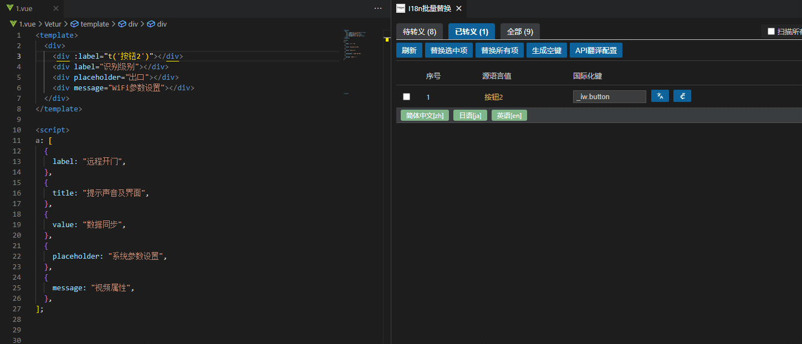
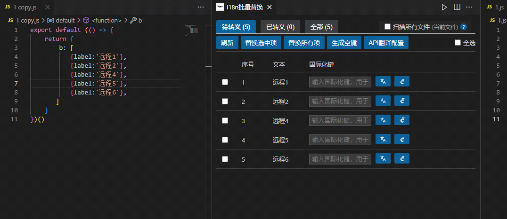

# i18n-swapper | 前端国际化文本转换工具

<div align="center">


</div>

> 一站式 VSCode 国际化解决方案，让前端多语言项目开发效率提升 n 倍

<p align="center">
  
</p>

## 安装

选择以下任一方式安装：

1. VSCode/Cursor 应用商店中搜索 **i18n swapper**
<p align="left">
  
</p>

2. VSCode 命令面板 (`Ctrl+P`) 输入：
   ```
   ext install chimoo.i18n-swapper
   ```

3. 直接从 [VSCode Marketplace](https://marketplace.visualstudio.com/items?itemName=chimoo.i18n-swapper) 下载

<p align="left">
  
</p>

首次安装提示选择源语言文件：
- 如已有中文国际化键值库，请选择它
- 系统将根据源语言库，自动转义 t 方法到预览模式


<p align="center">

# **已配置完成，开始享受高效国际化体验吧！🎉🎉🎉**

</p>

## 功能介绍

i18n-swapper 是一款革命性的 VSCode 扩展，专为前端国际化工程化设计，将繁琐的国际化流程简化至极，提供前所未有的开发体验。

### 功能亮点

- 👁️ **实时预览**：代码中直接查看翻译结果，所见即所得
- 🔍 **智能检测**：自动识别需国际化的文本，精准定位
- 🔄 **一键替换**：单击完成文本到国际化函数的转换
- 📦 **批量处理**：扫描整个项目，一次性处理所有国际化内容
- 🌐 **多语言支持**：集成翻译 API，支持 28+ 种语言自动翻译
- ⚙️ **高度可定制**：自定义函数名、样式、键名生成规则等
- 🔑 **智能键名**：基于内容自动生成有意义的键名，无需手动命名

### 核心优势 ✨

专为中文项目打造的全流程国际化解决方案：

1. **智能键值生成 & 多语言同步**  
   ⌨️ 中文内容一键生成标准化键值，实时对接翻译引擎，28+ 语种同步生成，彻底告别手动翻译

2. **智能路径反推**  
   🔍 基于内容自动定位键路径，无需手动检索，大幅提升开发效率

3. **多维度翻译洞察**  
   🌐 可视化管理所有翻译状态：
   - 跨语言对比检查
   - 缺失翻译提醒
   - 一键定位文件路径
   - 快速跳转代码引用

4. **云翻译深度集成**  
   ☁️ 无缝对接腾讯云翻译 API，工作流完全自动化

5. **空键批量生成**  
   🔑 一键为所有空键生成智能键名，自动处理结构，同步翻译到全部语言文件

6. **自定义显示风格**  
   - 支持 `t('译文')` 或 `t('key')(译文)` 显示模式
   - 可自定义译文颜色/大小/粗细
   - 支持自定义国际化函数名称

### 主要特性

- 🔍 **精准文本查找**：自动定位国际化键，智能引号处理
- 📂 **多文件格式**：支持 JSON/JS 文件，多文件路径配置
- 🚀 **高效批量操作**：全文件/全项目扫描，一键替换
- 🌍 **完整翻译流程**：键值生成、翻译、状态管理一体化
- 📊 **可视化管理**：直观展示多语言状态，快速定位问题
- 🔍 **智能筛选**：按文件名/路径快速过滤，精确定位

### 翻译方式

#### 1. 单体翻译功能

选中文本，右键菜单"替换为国际化调用"或快捷键 `Ctrl+Alt+Y`/`Cmd+Alt+Y`，插件会：

- 自动查找文本对应的国际化键
- 智能处理引号和括号
- 替换为国际化函数调用
- 自动处理 Vue 绑定语法（如 `label="值"` → `:label="t('key')"`）


##### 替换流程


#### 2. 批量替换功能

提供两种批量方式：
- **快速批量替换**：扫描当前文件，自动替换已存在的文本
- **可视化批量替换**：通过面板界面管理替换过程

<p align="left">
  
</p>

#### 批量替换流程


> 提示：已有源语言库的项目适合使用此功能；新项目建议使用面板功能自动创建键值。

### 进阶🚀 面板功能【全局可视化管理】

右键菜单"I18n Swapper: 打开面板"或快捷键 `Ctrl+Alt+I`/`Cmd+Alt+I` 打开国际化管理面板。

<p align="left">
  
</p>

#### 核心功能：

##### 1. 文本高亮识别

<p align="left">
  
</p>

##### 2. 国际化函数智能转义

<p align="left">
  
</p>

##### 3. 智能键路径填充

自动检索源语言库，反推键路径，一键完成替换


##### 4. 多语言缺失检测

通过颜色直观展示各语言文件翻译状态（绿色存在，红色缺失）


##### 5. 一键多语言翻译

插件会根据您的文本，请求[腾讯翻译API](#教程1配置api翻译)

再根据[多语言映射配置](#教程2配置多语言映射重磅功能强烈推荐)，生成所有语言的翻译文本

<p align="left">
  
</p>

##### 6. 灵活替换模式

根据场景选择单独/批量替换

<p align="left">
  
</p>

##### 7. 语言文件快速操作

左键跳转文件定位，右键快速编辑文本

<p align="left">
  
</p>

##### 8. 自动键名生成

<p align="left">
  
</p>

##### 9. 便捷悬浮操作面板

<p align="left">
  
</p>

##### 10. 全项目扫描【重磅】

一次性扫描整个项目，支持文件过滤、快速定位

<p align="left">
  
</p>

### 配置教程

#### 1. API翻译配置

<p align="left">
  
</p>

点击后打开API配置面板：

<p align="left">
  
</p>

#### 2. 多语言映射配置【强烈推荐】

<p align="left">
  
</p>

#### 3. 自定义面板设置（可选）

<p align="left">
  
</p>
<p align="left">
  
</p>

## 快速上手

### 1. 设置国际化文件

首次使用：
1. 打开命令面板 `Ctrl+Shift+P`/`Cmd+Shift+P`
2. 选择 `i18n-swapper: 设置国际化文件路径`
3. 选择国际化文件

### 2. 单文本替换

选中文本 → 快捷键 `Alt+Shift+I`/`Option+Shift+I`

### 3. 批量替换

命令面板中选择 `i18n-swapper: 批量替换国际化`

### 4. 快速批量替换

快捷键 `Alt+Shift+B`/`Option+Shift+B`

### 5. 文件筛选

开启"扫描所有文件"，使用顶部筛选框输入文件名/路径


```

| 选项 | 说明 | 默认值 |
| ----- | ---- | ----- |
| `localesPaths` | 国际化文件路径列表 | `[]` |
| `quoteType` | 生成代码中使用的引号类型 (`single` 或 `double`) | `single` |
| `functionName` | 国际化函数名称 | `t` |
| `scanPatterns` | 要扫描的属性模式列表（用于批量替换） | `[]` |
| `tencentTranslation.apiKey` | 腾讯云翻译 API 密钥 | `""` |
| `tencentTranslation.apiSecret` | 腾讯云翻译 API 密钥 | `""` |
| `tencentTranslation.region` | 腾讯云 API 区域 | `"ap-guangzhou"` |
| `tencentTranslation.sourceLanguage` | 源语言代码 | `"zh"` |
| `decorationStyle` | 国际化键预览样式 (`suffix` 或 `inline`) | `"suffix"` |
| `includeFiles` | 扫描工作区时要包含的文件或目录 | `[]` |
| `excludeFiles` | 扫描工作区时要排除的文件或目录 | `[默认排除]` |
| `autoGenerateKeyFromText` | 是否使用API生成有意义的键名 | `true` |
| `autoTranslateAllLanguages` | 是否自动翻译到所有语言文件 | `true` |
| `autoGenerateKeyPrefix` | 自动生成键名的前缀 | `""` |
| `scanTagContent` | 是否扫描HTML标签内的文本内容 | `true` |

```

## 项目结构

## 核心文件

- `extension.js` - 插件入口点，注册命令和激活上下文
- `src/panels/BatchReplacementPanel.js` - 批量替换面板的主类，协调各种服务

## 服务模块

- `src/panels/services/highlightService.js` - 处理代码高亮和装饰相关功能
- `src/panels/services/i18nKeyStatusService.js` - 管理i18n键在不同语言文件中的状态
- `src/panels/services/translationPanelService.js` - 处理面板中的翻译相关操作
- `src/panels/services/documentAnalyzer.js` - 分析文档内容，识别可国际化的文本
- `src/panels/services/languageFileManager.js` - 管理语言文件的创建和选择
- `src/panels/services/replacementService.js` - 处理文本替换为国际化调用的逻辑
- `src/panels/services/translationService.js` - 处理翻译API相关功能
- `src/panels/services/emptyKeysGeneratorService.js` - 处理自动生成空国际化键名功能

## 界面相关

- `src/panels/ui/panelHtmlGenerator.js` - 生成面板的HTML内容
- `src/panels/ui/components/panelTemplate.js` - 面板HTML模板
- `src/panels/ui/scripts/panelScripts.js` - 面板交互脚本
- `src/panels/ui/scripts/generateEmptyKeysScripts.js` - 空键生成相关脚本

## 工具和配置

- `src/utils/language-mappings.js` - 语言映射相关常量
- `src/utils/index.js` - 通用工具函数
- `src/config/defaultsConfig.js` - 默认配置项

## 模块化设计


1. **主控制器** - `BatchReplacementPanel.js` 作为主控制器，协调各个服务模块
2. **服务模块** - 每个服务模块负责一个特定功能领域：
   - 高亮服务 - 处理代码高亮和装饰
   - i18n键状态服务 - 管理国际化键的状态
   - 翻译面板服务 - 处理翻译相关操作
   - 文档分析服务 - 分析文档内容
   - 语言文件管理服务 - 处理语言文件
   - 替换服务 - 执行文本替换操作
3. **用户界面** - 界面生成与业务逻辑分离

模块间通过回调函数或状态对象传递，确保功能完整性的同时实现代码模块化。

这种设计具有以下优点：
- 提高代码可维护性和可读性
- 关注点分离，使每个模块职责清晰
- 便于测试和调试
- 支持团队协作开发

## 常见问题

**Q: 插件找不到我的国际化键？**  
A: 检查国际化文件路径是否正确，确认文本完全匹配。

**Q: 支持哪些文件格式？**  
A: JSON和JS文件（JS需导出对象）。

**Q: 如何修改快捷键？**  
A: 通过VSCode快捷键设置修改。

**Q: 项目不是用`t()`函数？**  
A: 通过`i18n-swapper.functionName`配置自定义函数名。

**Q: 如何获取腾讯云API密钥？**  
A: 访问[腾讯云控制台](https://console.cloud.tencent.com/)，在访问管理→API密钥管理创建。

**Q: 支持哪些语言翻译？**  
A: 支持腾讯云API提供的28+种语言。

**Q: 如何按文件名筛选？**  
A: 开启"扫描所有文件"后，使用顶部筛选框输入文件名/路径。

**Q: 如何仅扫描特定文件夹？**  
A: 在面板配置中指定要扫描的文件/目录。

**Q: 自动生成的键名格式？**  
A: 启用`autoGenerateKeyFromText`时根据文本内容生成，格式为`前缀.键名`。

## 许可证

i18n-swapper 遵循 [Apache License 2.0](LICENSE) 许可证。

## 版本更新

### v0.7.0 - 空键自动生成

新增空键自动生成功能，智能创建键名并翻译到所有语言文件。

### v0.6.0 - 扫描工作区

新增全工作区扫描功能，支持文件筛选和指定范围搜索。


